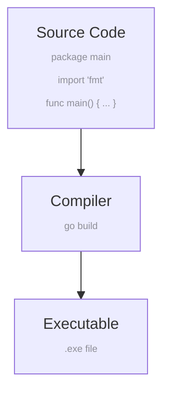

## Why GO ?
0. Fast and simple
1. Fast and lightweight
2. Concurrency support
3. Garbage collection
4. Statically typing
5. Compiled

### The compilation process

### Go Program Structure
We'll go over all of this later in more detail, but to sate your curiosity:

- `package main` lets the Go compiler know that we want this code to compile and run as a standalone program, as opposed to being a library that's imported by other programs.
- `import "fmt"` imports the `fmt` (formatting) package from the standard library. It allows us to use `fmt.Println` to print to the console.
- `func main()` defines the `main` function, the entry point for a Go program.

### Two Kinds of Errors

Generally speaking, there are two kinds of errors in programming:

- **Compilation errors**. Occur when code is compiled. It's generally better to have compilation errors because they'll never accidentally make it into production. You can't ship a program with a compiler error because the resulting executable won't even be created.
- **Runtime errors**. Occur when a program is running. These are generally worse because they can cause your program to crash or behave unexpectedly.
While we're in the browser it can be a bit hard to tell the difference because we run and compile the code in the same step.²